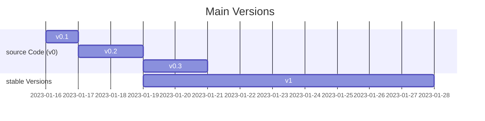

# Twitter Scraper

[](https://svgshare.com/i/ZhY.svg)
[](https://github.com/cognitivefactory/twitter-scraper/actions/workflows/python-app.yml)
[](https://github.com/cognitivefactory/twitter-scraper/actions/workflows/pylint.yml)
[](https://github.com/cognitivefactory/twitter-scraper)
[](https://github.com/ThomasByr)

1. [✏️ Setup](#️-setup)
2. [💁 More infos and Usage](#-more-infos-and-usage)
3. [🧪 Testing](#-testing)
4. [🧑‍🏫 Contributing](#-contributing)
5. [⚖️ License](#️-license)
6. [🔄 Changelog](#-changelog)
7. [🐛 Bugs \& TODO](#-bugs--todo)

## ✏️ Setup

> **Note** This project is currently under development. It is not yet ready for production.

Please install first the required packages with the following command:

```ps1
pip install --upgrade -r requirements.txt
```

Then you should setup a Twitter developer account and create a new app to get your API keys. You can find more information [here](https://developer.twitter.com/en/docs/twitter-api/getting-started/getting-access-to-the-twitter-api).

Then you should create a new file named `.env` in the root directory of the project and add the following lines (based on [.env.example](.env.example)):

```txt
API_KEY =
API_KEY_SECRET =
BEARER_TOKEN =
```

## 💁 More infos and Usage

## 🧪 Testing

Oh god! Please don't... Still, make sure you have `pytest` installed and run the following command:

```ps1
pytest .\twitter_scraper\
```

You can also use the vscode UI to run the tests.

## 🧑‍🏫 Contributing

If you ever want to contribute, please begin by reading our [Contributing Guidelines](.github/CONTRIBUTING.md).

> The standard procedure is :
>
> ```txt
> fork -> git branch -> push -> pull request
> ```
>
> Note that we won't accept any PR :
>
> - that does not follow our Contributing Guidelines
> - that is not sufficiently commented or isn't well formated
> - without any proper test suite
> - with a failing or incomplete test suite

Happy coding ! 🙂

## ⚖️ License

This project is licensed under the [CeCILL-C FREE SOFTWARE LICENSE AGREEMENT](LICENSE). For more information, please refer to the [official website](https://cecill.info/licences/Licence_CeCILL-C_V1-en.html).

## 🔄 Changelog

See [changelog.md](changelog.md) for more information.



<details>
  <summary>  Stable Version 1 (click here to expand) </summary>

**v1.0** first stable release

- `collection.abc` instead of `typing` (deprecated)
- lowered the requirements
- min supported python version is now 3.10.6

**v1.1** more queries and less storage

- encoded `tweet.content` into `bytes` for storage
- added retweet and reply selectors to `SearchQuery`

</details>

## 🐛 Bugs & TODO

**known bugs** (final correction patch version) [see Issues](https://github.com/?)

- `tweet.date` is always `None` when scraping (stored as `0`)

**todo** (first implementation version)

- [x] encode `tweet.content` into `bytes` for storage
- [ ] should add `tweet.date` back in when scraping
- [ ] add large search queries
- [ ] _a posteriori_ tweet inspection
